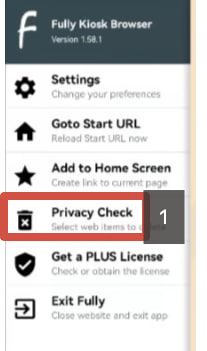

# Лицензирование

Nekassir является прямой лицензией iiko. Личный кабинет получает лицензии на основе привязанного к нему iiko uid, соответственно кабинет будет иметь столько лицензий, сколько заказано на тот или иной кабинет.&#x20;

Раздел лицензирования находится тут [https://panel.nekassir.tech/licence](https://panel.nekassir.tech/licence)&#x20;

Он необходим для мониторинга количества и дат окончания лицензий по киоскам

<figure><figcaption></figcaption></figure>

<figure><figcaption></figcaption></figure>
