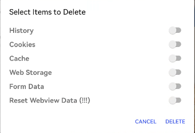

# 3. Белый экран/Ошибка HTTP запроса/Не найден код сборки

Ошибка может быть вызвана проблемами с сетью, например, если на киоске или роутере установлен vpn. Также стоит проверит брандмауер

Одной из причин данной проблемы может быть неверное время в операционной системе

Если белый экран на андроиде, в fully нужно сделать свайп слева направо, запросит пин, пин по умолчанию 1234, перейти в раздел "Privacy chek", проставить все пункты и нажать Delete, это сбросит кэш, куки и прочее

<figure><figcaption></figcaption></figure>

